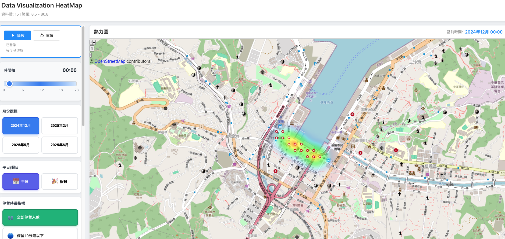

# Heatmap Visualization Web 

> An interactive geospatial visualization platform for analyzing customer distribution patterns across Taiwan using real-time heatmap technology.

[](https://www.python.org/)
[](https://fastapi.tiangolo.com/)
[](https://vuejs.org/)

## Project Overview

A full-stack web application that visualizes geographic user distribution data through interactive heatmaps on Taiwan's map. The system features automatic time-based cycling, multi-dimensional filtering, and comprehensive demographic analytics.

**Key Highlights:**
- **High Performance**: Sub-500ms API response time with ~260,000 coordinate conversions/second
- **Rich Visualization**: Real-time heatmap updates with smooth transitions
- **Advanced Analytics**: Gender and age distribution charts
- **Auto-Playback**: Time-lapse visualization cycling through 24 hours (1-second intervals)
- **Multi-Filter System**: Month, hour, and duration metric filtering
- **Responsive Design**: From 320px mobile to 4K desktop

## Demo



*Interactive heatmap visualization showing customer distribution patterns across Taiwan with real-time demographic analytics*

## Key Features

### Interactive Heatmap
- Grid-based density visualization using OpenLayers
- Smooth color transitions based on user density
- Real-time updates on filter changes

### Time-Based Analysis
- **Auto-cycling**: 1-second intervals through 24-hour timeline
- **Manual controls**: Play/pause/reset functionality
- **Timeline slider**: Direct hour selection with visual feedback

### Multi-Dimensional Filtering
- **Monthly Analysis**: 4 months of data (Dec 2024, Feb/May/Aug 2025)
- **Duration Metrics**:
  - Total users
  - Quick visits (<10 min)
  - Medium stays (10-30 min)
  - Long visits (>30 min)

### Demographic Insights
- **Gender Distribution**: Interactive pie chart
- **Age Groups**: 9 age brackets with percentage breakdown
- **ECharts Integration**: Smooth animations and responsive tooltips

## Architecture

### Technology Stack

**Backend**
- **Framework**: FastAPI (Python 3.9+) - Modern, high-performance REST API
- **Data Processing**: Pandas + NumPy - Efficient data manipulation
- **Coordinate Conversion**: Numba JIT compilation for 260k+ conversions/sec
- **Server**: Uvicorn ASGI server with auto-reload

**Frontend**
- **Framework**: Vue.js 3 (Composition API) - Reactive UI components
- **Mapping**: OpenLayers 9 - Advanced geospatial visualization
- **Charts**: Apache ECharts 5 - Professional data visualization
- **Projection**: Proj4 - Coordinate system transformations
- **Build Tool**: Vite - Lightning-fast HMR and builds

**Data Pipeline**
- **Format**: CSV with TWD97 TM2 grid coordinates
- **Cache**: In-memory 5MB data cache for instant access
- **Conversion**: Custom Numba-accelerated coordinate transformer

### System Design

```
┌─────────────────┐     ┌──────────────────┐     ┌─────────────────┐
│   Vue 3 SPA     │────▶│   FastAPI REST   │────▶│   Pandas Data   │
│   (Frontend)    │◀────│   (Backend)      │◀────│   (Processing)  │
└─────────────────┘     └──────────────────┘     └─────────────────┘
        │                        │                         │
    OpenLayers              Uvicorn ASGI             Numba JIT
    ECharts 5               CORS Enabled          TWD97→WGS84
```

## Quick Start

### Prerequisites
- Python 3.9+ (conda environment recommended)
- Node.js 16.x or higher
- Git

### Development Setup

**1. Clone Repository**
```bash
git clone <repository-url>
cd store_heatmap
```

**2. Backend Setup**
```bash
conda create -n fapi python=3.9 -y
conda activate fapi
cd backend
pip install -r requirements.txt
python -m uvicorn src.main:app --reload --host 127.0.0.1 --port 8000
```

**3. Frontend Setup** (new terminal)
```bash
cd frontend
npm install
npm run dev
```

**4. Access Application**
- Frontend: http://localhost:5173
- API Documentation: http://127.0.0.1:8000/docs
- Interactive API: http://127.0.0.1:8000/redoc

## Production Deployment

### Building Windows Executable

Package into a **single standalone .exe** file:
- Python runtime + all dependencies
- Backend API (FastAPI + Uvicorn)
- Frontend UI (Vue 3 + OpenLayers + ECharts)
- Data file (data.csv)

**No installation required for end users!**

#### Build Steps

**1. Build Frontend**
```bash
cd frontend
npm run build
```

**2. Prepare Package**

Automated script:

```bash
./prepare_for_windows.sh
```

equired folders:
```bash
mkdir ~/store_heatmap_pack
cp -r backend ~/store_heatmap_pack/              # Backend source code
cp -r frontend/dist ~/store_heatmap_pack/frontend/  # Built frontend
cp -r data ~/store_heatmap_pack/                 # Data files
```

**3. Build on Windows**
```powershell
cd backend
pip install -r requirements.txt pyinstaller
python build_exe.py
```

**4. Result**
```
backend\dist\StoreHeatmap.exe  (~100-150 MB)
```

Double-click to run - browser opens automatically!

## 📁 Project Structure

```
store_heatmap/
├── backend/                    # Python FastAPI backend
│   ├── src/
│   │   ├── main.py            # Application entry point
│   │   ├── api/               # REST API routes and models
│   │   ├── services/          # Business logic layer
│   │   │   ├── data_loader.py         # CSV data caching
│   │   │   └── coordinate_converter.py # TWD97→WGS84
│   │   └── utils/             # Configuration
│   └── requirements.txt       # Dependencies
│
├── frontend/                   # Vue.js 3 frontend
│   ├── src/
│   │   ├── components/        # Vue components
│   │   │   ├── map/          # HeatmapMap
│   │   │   ├── charts/       # GenderChart, AgeChart
│   │   │   └── controls/     # Playback controls
│   │   ├── composables/      # Composition API logic
│   │   │   ├── useAutoplay.js   # 1-sec time cycling
│   │   │   └── useHeatmapData.js # API integration
│   │   └── services/         # API client
│   └── vite.config.js        # Build configuration
│
├── data/
│   └── data.csv              # TWD97 TM2 grid data
│
└── specs/                     # Technical documentation
```

## API Endpoints

**Data**
- `GET /api/heatmap` - Grid-based heatmap coordinates
  - Params: `month`, `hour`, `metric`
  - Returns: `[{lat, lng, value}]`

- `GET /api/demographics` - Gender/age statistics
  - Returns: Gender % + 9 age groups

**System**
- `GET /api/metadata` - Available filters
- `GET /health` - Health check
- `GET /docs` - Swagger UI

## ⚡ Performance

- **API Response**: <500ms average
- **Coordinate Conversion**: ~260,000/sec (Numba)
- **Memory Usage**: ~5MB cache
- **Frontend Bundle**: 1.1MB gzipped
- **Initial Load**: <2s

## Technical Highlights

1. **High-Performance Coordinate Conversion**
   - Numba JIT compilation
   - Vectorized NumPy operations
   - 260k+ conversions/second

2. **Reactive State Management**
   - Vue 3 Composition API
   - Efficient dependency tracking
   - Minimal re-renders

3. **Smart Data Caching**
   - In-memory DataFrame
   - On-demand filtering
   - 5MB footprint

4. **Production-Ready Packaging**
   - Single-file executable
   - Embedded Python runtime
   - Auto-browser launch

## Data Model

> **Data Privacy Notice**: Due to privacy and confidentiality concerns, the actual customer data files (`data/data.csv`) are **not included** in this GitHub repository. The application requires a properly formatted CSV file with TWD97 TM2 grid coordinates to function. Contact the developer for a sample dataset or see the schema below to prepare your own data.

## Documentation

- [Developer Quickstart](specs/001-heatmap-visualization/quickstart.md)
- [Data Model](specs/001-heatmap-visualization/data-model.md)
- [API Specification](specs/001-heatmap-visualization/spec.md)

## Contributing

Contributions welcome! Please:
1. Fork the repository
2. Create feature branch (`git checkout -b feature/AmazingFeature`)
3. Commit changes (`git commit -m 'Add AmazingFeature'`)
4. Push to branch (`git push origin feature/AmazingFeature`)
5. Open Pull Request

## License

This project is available for educational and portfolio demonstration purposes.

## Contact
For questions, issues, or collaboration inquiries:

- Developer: Tom Huang
- Email: huang1473690@gmail.com
